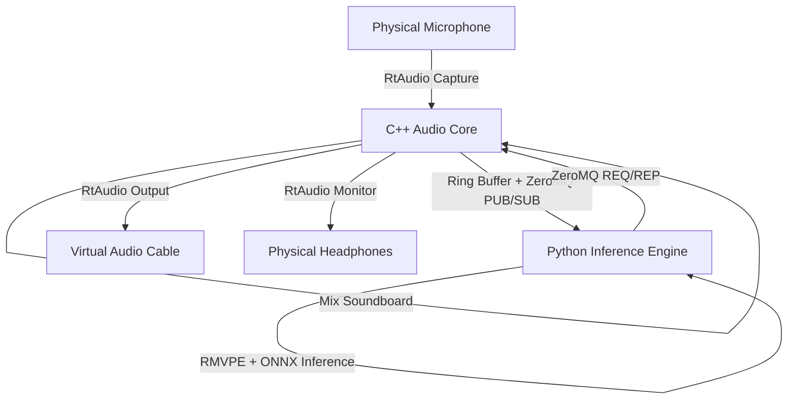

# Audio Core Pipeline Design

**Spec**: `.specs/features/audio-core/spec.md`
**Status**: Draft

---

## Architecture Overview

The audio pipeline consists of a C++ Audio Core for low-latency capture/playback and a Python Inference Engine for AI processing. They communicate via a fast IPC mechanism (e.g., local ZeroMQ or gRPC, but ZeroMQ is preferred for raw binary speed).

## Tech Decisions

| Decision          | Choice          | Rationale     |
| ----------------- | --------------- | ------------- |
| C++ Audio Library | RtAudio         | Cross-platform, provides WASAPI/DirectSound support out of the box, widely used for low latency. |
| IPC Mechanism     | ZeroMQ          | Extremely fast for binary streaming. gRPC adds protobuf overhead which might be too slow for 128ms audio chunks. |
| Python Environment| `uv` + Virtualenv| Fast package management, easily reproducible isolated environment for PyTorch/ONNX. |
| Build System      | CMake           | Standard for C++ cross-platform building, easy to integrate with Tauri later. |

---

## Components

### C++ Audio Core

- **Purpose**: Handles device selection, audio capture, ring buffering, and playback.
- **Location**: `src-cpp/`
- **Interfaces**:
  - `startCapture(deviceId)`
  - `startPlayback(deviceId)`
  - `setInferenceBypass(bool)`
- **Dependencies**: RtAudio, cppzmq (ZeroMQ).

### Python Inference Engine

- **Purpose**: Receives raw float32 audio chunks, applies F0 extraction and RVC inference, and returns processed chunks.
- **Location**: `src-python/`
- **Interfaces**:
  - `load_model(model_path, index_path)`
  - `process_chunk(audio_bytes)`
- **Dependencies**: PyTorch, ONNXRuntime, PyZMQ, librosa.

---

## Error Handling Strategy

| Error Scenario | Handling      | User Impact      |
| -------------- | ------------- | ---------------- |
| IPC Timeout    | C++ Core bypasses inference and passes mic audio directly (or silences it based on setting). | User's real voice is heard, but stream doesn't crash. |
| Python Engine Crash | C++ attempts to restart the Python subprocess and enters bypass mode. | Temporary loss of voice changing effect. |
| Audio Device Disconnected | C++ halts the stream and waits for device re-initialization. | Audio stops. |
