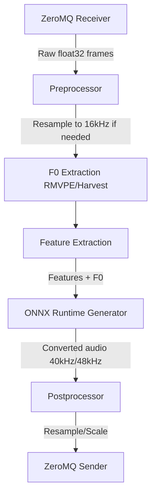

# RVC Inference Integration Design

**Spec**: `.specs/features/rvc-inference/spec.md`
**Status**: Draft

---

## Architecture Overview

The Python `server.py` currently echoes back scaled audio. We will replace the dummy processing step with a call to an RVC ONNX model.

## Tech Decisions

| Decision          | Choice          | Rationale     |
| ----------------- | --------------- | ------------- |
| Model Format      | ONNX            | ONNX Runtime offers excellent cross-platform performance and lower cold-start latency compared to loading raw PyTorch `.pth` models dynamically. |
| Pitch Extraction  | RMVPE / PyWorld | RMVPE is currently the state-of-the-art for RVC, offering the best quality and noise resistance. Harvest (PyWorld) is a good CPU fallback. |
| Processing Unit   | CUDA / CPU      | We will attempt to load the ONNX model using the `CUDAExecutionProvider`. If a compatible NVIDIA GPU is not available, it will gracefully fall back to `CPUExecutionProvider`. |

---

## Components

### `src-python/rvc_engine.py` (New)

- **Purpose**: Wraps the ONNX runtime session, Huberto feature extraction, and F0 estimation into a clean class.
- **Location**: `src-python/soundboard_engine/rvc_engine.py`
- **Interfaces**:
  - `__init__(model_path: str)`
  - `process(audio: np.ndarray, f0_up_key: int) -> np.ndarray`
- **Dependencies**: `onnxruntime`, `librosa`, `numpy`.

### `src-python/server.py` (Modify)

- **Purpose**: Initializes the `RVCEngine` globally, then in the ZeroMQ loop, passes the chunks to `engine.process()`.
- **Location**: `src-python/server.py`
- **Reuses**: Existing ZeroMQ boilerplate.

---

## Open Issues / Risks

- **Chunk Size Limitations**: RVC inference works best on chunks of at least ~250ms to accurately detect F0. If the C++ core sends chunks of 10.6ms (512 frames @ 48kHz), the Python engine will need to buffer them internally until a sufficient window is accumulated (e.g., 2048 or 4096 frames), or run an overlapping window mechanism (overlap-add) to prevent clicking at chunk boundaries. For the MVP, we will accumulate a fixed block size in Python before inference and return the buffer.
