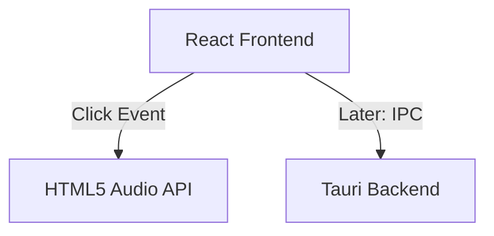

# Soundboard UI Design

**Spec**: `.specs/features/soundboard-ui/spec.md`
**Status**: Draft

---

## Architecture Overview

We will use Vite to initialize a React + TypeScript project, and then add Tauri to it. This keeps the frontend very lightweight.

## Tech Decisions

| Decision          | Choice          | Rationale     |
| ----------------- | --------------- | ------------- |
| Framework         | React + Vite    | Fast iteration, huge ecosystem for UI components. |
| Desktop Wrapper   | Tauri           | Uses system webview (Edge WebView2 on Windows). Consumes ~30MB RAM compared to Electron's 200MB+. |
| Styling           | Vanilla CSS / CSS Modules | As requested in the system prompt for modern web design, we will use plain CSS focusing on glassmorphism, dark mode, and micro-animations, avoiding Tailwind unless requested. |

---

## Components

### `App.tsx`
- **Purpose**: Main grid layout for the soundboard.
- **Location**: `src-ui/src/App.tsx`

### `SoundButton.tsx`
- **Purpose**: A visually rich button with hover effects and click animations.
- **Location**: `src-ui/src/components/SoundButton.tsx`
- **Props**: `name: string`, `audioSrc: string`
