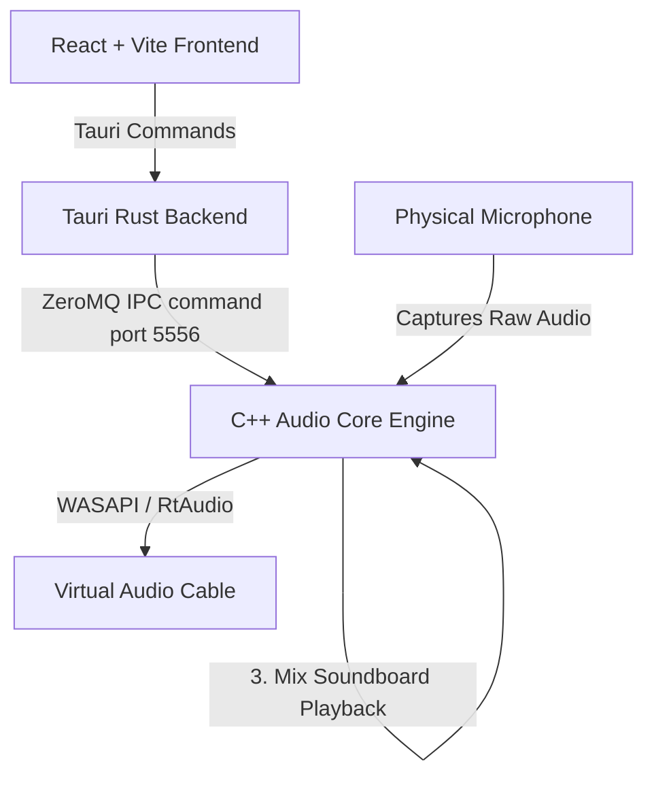

# JT Soundboard

A high-performance, low-latency modular soundboard and real-time voice changer. It intercepts microphone input, applies real-time RVC (Retrieval-based Voice Conversion) and custom C++ DSP (Digital Signal Processing) voice modulation, mixes in soundboard clips, and routes the final audio stream to a virtual audio cable (e.g., VB-Cable) for use in apps like Discord, OBS, or games.

---

## Key Features

1. **Self-Contained Architecture**: Spawns the C++ backend automatically in a hidden background window when the UI starts.
2. **Real-Time Voice Effects**:
   - **Satanic 1**: Custom C++ DSP pipeline containing Pitch Shift (0.65x) + Chorus Modulation (1.5Hz) + Waveshaping Saturation (1.5x drive).
   - **Satanic 2**: Raw buffer modulator with Ring Modulation (45Hz carrier) + Dual-Layer Mix (60% grave + 40% modulated) + Hard Peak Clipping at `±0.8`.
   - **Satanic 3 (Hybrid)**: Layer 1 (0.60x pitch + 1.5Hz Chorus) and Layer 2 (40Hz Ring Mod + 0.70x pitch) mixed at `60/40`, run through cubic saturation and hard clipping at `±0.85`.
3. **Voice Isolation (Noise Suppression)**: Real-time microphone background noise cancellation using the RNNoise neural network model.
4. **RVC Voice Changer**: Deep learning voice conversion powered by ONNX Runtime, offering RMVPE pitch estimation and low-latency audio inference block processing.
5. **Soundboard**: Play audio clips with individual volume controls, start/end trimming, and output mixing.
6. **Smooth Transitions**: Sample-by-sample linear interpolation (lerp) mix transition on all voice effects to completely eliminate audio clicks and pops when toggled.

---

## System Architecture

The application is split into two major components communicating via local ZeroMQ (ZMQ) sockets:



- **Frontend**: React application built with TailwindCSS, styled with a glassmorphism dark theme.
- **Backend (Tauri)**: Rust-based desktop bridge that manages the window, hooks up hotkeys, and runs the C++ process.
- **Audio Engine (C++)**: High-priority real-time audio thread executing the duplex callback. Communicates via IPC on port `5556`.

---

## Local Build Instructions

### Prerequisites
- [Rust Toolchain (Cargo)](https://www.rust-lang.org/tools/install)
- [Node.js (v18+)](https://nodejs.org/)
- [CMake (v3.14+)](https://cmake.org/download/)
- [Visual Studio (with C++ Desktop Development)](https://visualstudio.microsoft.com/)
- A Virtual Audio Cable (e.g., [VB-Cable](https://vb-audio.com/Cable/)) installed on Windows.

### 1. Compile the C++ Backend Core
Run the following commands from the root directory to generate the release binaries:
```bash
cmake -B build-cpp -S src-cpp -DCMAKE_BUILD_TYPE=Release
cmake --build build-cpp --config Release --target SoundboardCore
```
This automatically fetches:
- `RtAudio` for low-latency WASAPI audio.
- `libzmq` & `cppzmq` for IPC socket communication.
- `RNNoise` (werman fork) for noise suppression.
- `ONNX Runtime` for deep learning execution.

### 2. Set Up Tauri Core Resources
Create the resource folder under `src-tauri` and copy the compiled executables and dependencies:
```powershell
New-Item -ItemType Directory -Force -Path 'src-ui/src-tauri/core'
Copy-Item -Path 'build-cpp/Release/SoundboardCore.exe', 'build-cpp/Release/onnxruntime.dll', 'build-cpp/Release/onnxruntime_providers_shared.dll', 'build-cpp/Release/rtaudio.dll', 'build-cpp/Release/libzmq-v145-mt-4_3_6.dll' -Destination 'src-ui/src-tauri/core/' -Force
```

### 3. Build the Desktop App
Navigate to the `src-ui` directory, install packages, and build the Tauri production bundle:
```bash
cd src-ui
npm install
npm run tauri build
```
The output installers will be available in:
`src-ui/src-tauri/target/release/bundle/`

---

## Deployment & CI/CD
This project uses GitHub Actions to automate release generation. When a tag matching `v*` (e.g., `v1.0.0`) is pushed to the remote repository, the pipeline compiles both the C++ and Rust codebases on a `windows-latest` runner and attaches the standalone `.msi` and `.exe` installers to a new GitHub Release.
